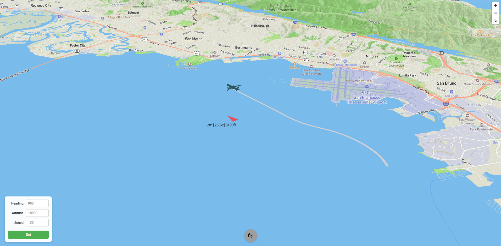

# Digital ATC

A flight simulation interface with an LLM-powered digital pilot that parses ATC instructions and controls a point-mass aircraft over the San Francisco Bay Area using Mapbox terrain.



## What is this?

A real-time flight simulator that:
- Renders a 3D aircraft over Mapbox terrain with simplified physics
- Accepts ATC instructions via LLM integration
- Generates proper readbacks with ICAO/NATO phonetics
- Displays flight path, heading, speed, and altitude in real-time
- Supports manual controls and automated target following

## Quick Start

```bash
npm i && npm run dev
```

Set your Mapbox token in `.env`:
```
VITE_MAPBOX_TOKEN=your_token_here
```

## Current Status

**What's Working:**
- ✅ Point-mass flight simulation with realistic turn rates and climb/descent
- ✅ 3D aircraft rendering with Three.js over Mapbox terrain
- ✅ Real-time position tracking with trail
- ✅ Manual controls (keyboard) and automated target setting

**What's Next:**
- 🔄 LLM integration for ATC instruction parsing
- 🔄 Automated readback generation with phonetics
- 🔄 Conflict detection and safety flagging
- 🔄 Scenario playback system
- 🔄 ATC console interface

## Project Structure

```
/schemas          JSON schemas for LLM I/O
/prompts          System and developer prompts for LLM
/lexicon          ICAO/NATO phonetics and FAA number words
/scenarios        Demo scenarios with ATC scripts
/src/components   Vue components (MapboxTerrain, sim, MapboxThree)
```

## Controls

- **Arrow Up/Down**: Speed control
- **A/D**: Turn left/right
- **W/S**: Pitch down/up (descend/climb)
- **Input Fields**: Set heading, altitude, or speed targets
- **Set Button**: Apply all input values

## Tech Stack

- Vue 3 + Vite
- Mapbox GL JS
- Three.js
- Point-mass physics simulation

## References

- [FAA AIM Chapter 4-2: Radio Communications](https://www.faa.gov/air_traffic/publications/atpubs/aim_html/chap4_section_2.html)
- [FAA Pilot/Controller Glossary](https://www.faa.gov/air_traffic/publications/media/PCG_Chg_2_dtd_3-21-24.pdf)
- [ICAO Radiotelephony Alphabet](https://www.icao.int/pages/alphabetradiotelephony.aspx)

## License

MIT
